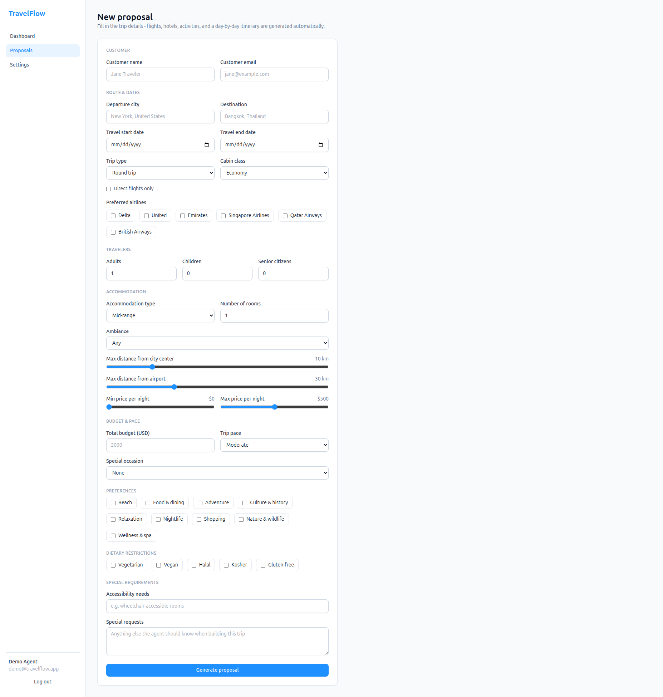
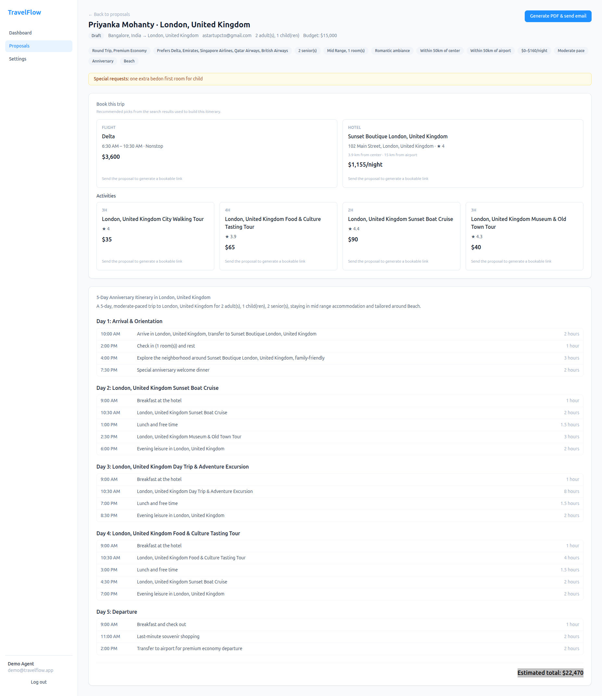
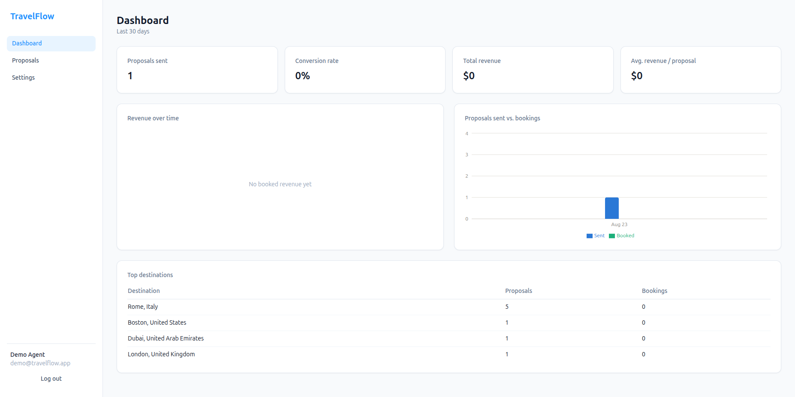
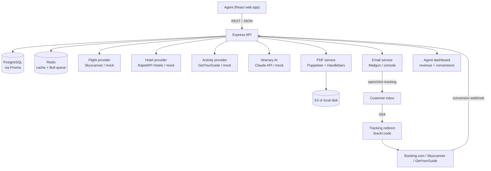

# TRAVELFLOW

**AI-powered travel proposal and itinerary generation software for travel agents.**

TravelFlow is an open-source SaaS platform that helps independent travel agents and
boutique agencies turn a customer's trip request into a beautiful, bookable, branded
proposal in minutes instead of hours. It searches flights, hotels, and activities,
generates a day-by-day AI itinerary, produces a client-ready branded PDF, emails it
to the customer, and tracks affiliate-link clicks and commission-earning bookings on
a live agent dashboard.

[](https://www.typescriptlang.org/)
[](https://react.dev/)
[](https://nodejs.org/)
[](https://expressjs.com/)
[](https://www.postgresql.org/)
[](https://www.prisma.io/)
[](https://redis.io/)
[](https://tailwindcss.com/)
[](https://www.anthropic.com/)
[](#license)

---

## Contents

- [What is TravelFlow?](#what-is-travelflow)
- [Key features](#key-features)
- [Trip parameters captured](#trip-parameters-captured)
- [Tech stack](#tech-stack)
- [Architecture](#architecture)
- [Live providers vs. built-in mocks](#live-providers-vs-built-in-mocks)
- [Other implementation notes](#other-implementation-notes)
- [Getting started](#getting-started)
- [Environment variables](#environment-variables)
- [API reference](#api-reference)
- [Project structure](#project-structure)
- [NPM scripts](#npm-scripts)
- [Testing status](#testing-status)
- [Roadmap](#roadmap)
- [Contributing](#contributing)
- [License](#license)

---

## What is TravelFlow?

Independent travel agents lose hours per booking manually researching flights,
hotels, and activities, then hand-assembling a proposal document. TravelFlow
automates that workflow end to end:

1. **Intake** – an agent enters a customer's trip request: route, dates, traveler
   mix, budget, accommodation preferences, and trip style.
2. **Search** – TravelFlow searches flights (Skyscanner), hotels (RapidAPI
   Hotels), and activities (GetYourGuide) in parallel, filtered by everything the
   agent specified.
3. **Generate** – Claude (Anthropic's AI model) writes a personalized, day-by-day
   itinerary tailored to the trip's pace, occasion, dietary needs, and interests.
4. **Package** – a branded PDF proposal is rendered (Puppeteer + Handlebars) with
   the agent's logo and colors, plus a "book this trip" section with trackable
   deep links to each recommended flight, hotel, and activity.
5. **Send & track** – the proposal is emailed to the customer with open and
   click tracking; every affiliate link tracks clicks and bookings, feeding a
   real-time revenue and conversion dashboard.

It's built as a reference-quality, production-shaped monorepo: a real Express +
PostgreSQL + Redis backend and a React + Vite frontend, useful both as a working
travel-agent tool and as a template for AI-assisted SaaS proposal automation.

## Key features

- **AI itinerary generation** – day-by-day travel plans generated by the Claude
  API, personalized for pace, special occasions, dietary restrictions, and
  accessibility needs, with a deterministic offline fallback when no API key is
  configured
- **Multi-source travel search** – parallel flight, hotel, and activity search
  with realistic pricing that responds to cabin class, accommodation tier, room
  count, and traveler mix
- **Branded PDF proposals** – Puppeteer-rendered, agent-branded PDFs with a
  live "book this trip" breakdown, not just a static itinerary
- **Affiliate commission tracking** – every flight, hotel, and activity gets its
  own short trackable link with click and conversion analytics, feeding a
  revenue dashboard built for travel-agent affiliate programs (Booking.com,
  Skyscanner, GetYourGuide)
- **Email delivery with open/click tracking** – Mailgun-backed proposal
  delivery with a tracking pixel and webhook-driven delivery status
- **Agent dashboard** – proposals sent, conversion rate, revenue trend, and
  top-destination analytics
- **Self-contained authentication** – JWT + bcrypt auth, no third-party account
  required to run locally
- **Pluggable provider architecture** – every external API (flights, hotels,
  activities, AI, email, storage) sits behind an interface with a real
  implementation and a mock fallback, selected automatically by environment
  variable

## Trip parameters captured

The intake form captures every parameter that materially changes trip price or
itinerary content, not just the basics:

- **Route & flight**: origin and destination (with city/country autocomplete),
  round-trip vs. one-way, cabin class (economy through first), direct-flights-only,
  preferred airlines
- **Travelers**: adults, children (with ages, so activities stay
  family-appropriate), senior citizens - each priced differently (children get
  roughly 25-50% off flights/activities, seniors roughly 10-15% off - see
  `apps/api/src/services/itineraryService.ts`)
- **Accommodation**: budget / mid-range / luxury tier, number of rooms, ambiance
  (romantic, family, business, quiet, lively, luxury), maximum distance from
  city center, maximum distance from the airport, price-per-night range -
  `apps/api/src/services/providers/hotelProvider.ts` filters hotels on all of
  these and relaxes them progressively (price first, then ambiance, keeping the
  distance constraint longest) when a combination has no exact match
- **Trip style**: pace (relaxed / moderate / packed, which changes how many
  activities are scheduled per day), special occasion (honeymoon, anniversary,
  birthday, family reunion), dietary restrictions, accessibility needs, and
  free-text special requests

Cabin class and accommodation tier alone can swing the estimated cost of the
same route and dates from roughly $6,000 to $16,000 in the built-in pricing
model - see `CABIN_CLASS_MULTIPLIER` in `flightProvider.ts` and
`TIER_PRICE_MULTIPLIER` in `hotelProvider.ts`.

## Tech stack

| Layer | Technology |
|---|---|
| Frontend | React 18, TypeScript, Vite, Tailwind CSS, TanStack Query, React Hook Form, React Router, Recharts |
| Backend | Node.js 20+, Express, TypeScript, Zod validation |
| Database | PostgreSQL via Prisma ORM |
| Caching & queues | Redis, Bull |
| AI | Claude API (Anthropic) for itinerary generation |
| PDF generation | Puppeteer + Handlebars |
| Email | Mailgun (with console/disk fallback) |
| File storage | AWS S3 (with local-disk fallback) |
| Auth | JWT + bcrypt |
| Infra (local) | Docker Compose (PostgreSQL, Redis) |
| CI | GitHub Actions (typecheck, build; deploy templates for Vercel/Railway) |

<h2 align="center">TravelFlow Screens</h2>

<p align="center">
  
   
</p>

<p align="center">
  
  
  
</p>

## Architecture



## Live providers vs. built-in mocks

Real travel proposal automation depends on several paid third-party APIs. Every
one of them sits behind a provider interface with a deterministic mock
fallback, so the whole application runs and produces realistic output with
zero API keys configured:

| Capability | Live implementation | Fallback (no API key set) |
|---|---|---|
| Flights | Skyscanner via RapidAPI | Deterministic mock flights, priced by cabin class and trip type |
| Hotels | RapidAPI Hotels | Deterministic mock hotels, priced and filtered by tier/ambiance/distance |
| Activities | GetYourGuide | Deterministic mock activities |
| Itinerary AI | Claude API (`claude-3-5-sonnet`) | Deterministic mock itinerary builder |
| Email delivery | Mailgun (open/click tracking) | Logged to console and written to `apps/api/uploads/outbox/*.html` |
| File storage | AWS S3 | Local disk, served at `/uploads/*` |

Add the corresponding key to `apps/api/.env` and that provider switches to the
live implementation automatically - no code changes needed (see
`apps/api/src/config/env.ts` and `apps/api/src/services/providers/`). Every
live provider also falls back to mock data if a request fails, so a bad or
rate-limited API key degrades gracefully instead of breaking proposal
generation.

## Other implementation notes

- **Authentication is self-contained JWT + bcrypt**, not Clerk. The concrete
  API examples in the original build spec already described plain
  email/password endpoints (`POST /auth/register`, `POST /auth/login`,
  `GET /auth/me`), so that's what's implemented - no external auth account
  required to run the app. Swapping in Clerk later means replacing
  `apps/api/src/middleware/auth.ts` and `authController.ts`.
- **UI components are hand-written Tailwind components** (`Button`, `Input`,
  `Select`, `Card`, `Badge`, `RangeSlider` in `apps/web/src/components/common/`)
  rather than a generated component-library scaffold - same visual result,
  far fewer files.
- **City and airline autocomplete are static lists** (`apps/web/src/data/`)
  rather than a live places/geocoding API - swappable later without touching
  the form markup.
- **No billing, error tracking, or metrics wiring** - Stripe billing, Sentry,
  and Prometheus are out of scope for this build and aren't meaningful
  without a real account behind them.
- **Nothing is deployed.** `.github/workflows/deploy-*.yml` are ready
  templates for Vercel (web) and Railway (API) once `VERCEL_TOKEN` /
  `RAILWAY_TOKEN` secrets are added to the repository.
- **The agent settings page is currently read-only.** Branding and affiliate-ID
  fields exist on the `User` model and render on the page, but there's no
  `PUT` endpoint to edit them yet.

## Getting started

### Prerequisites

- [Docker](https://www.docker.com/) (for local PostgreSQL and Redis)
- [Node.js](https://nodejs.org/) 18+ (20+ recommended) and npm

### Setup

```bash
git clone https://github.com/TravelXML/travelflow.git
cd travelflow
npm install

# PostgreSQL (port 5544) and Redis (port 6390) - non-default ports chosen to
# avoid clashing with anything already running locally on 5432/6379.
docker compose up -d postgres redis

# Backend
cp apps/api/.env.example apps/api/.env
npm run --workspace apps/api prisma:generate
npm run --workspace apps/api prisma:migrate
npm run --workspace apps/api seed        # creates demo@travelflow.app / demo1234
npm run dev:api                          # http://localhost:3001

# Frontend (in a new terminal)
cp apps/web/.env.example apps/web/.env.local
npm run dev:web                          # http://localhost:5173
```

Open `http://localhost:5173` and log in with `demo@travelflow.app` /
`demo1234`, or create your own account.

To enable a live provider, add its API key to `apps/api/.env` (see
[Environment variables](#environment-variables)) and restart the API - no
other changes are needed.

## Environment variables

### Backend (`apps/api/.env`)

| Variable | Required | Description |
|---|---|---|
| `DATABASE_URL` | Yes | PostgreSQL connection string |
| `REDIS_URL` | Yes | Redis connection string |
| `JWT_SECRET` | Yes | Secret used to sign auth tokens |
| `JWT_EXPIRES_IN` | No | Token lifetime (default `7d`) |
| `PORT` | No | API port (default `3001`) |
| `FRONTEND_URL` | No | Used for CORS (default `http://localhost:5173`) |
| `PUBLIC_API_URL` | No | Base URL used to build tracking links and PDF asset URLs |
| `LOG_LEVEL` | No | Winston log level (default `info`) |
| `ANTHROPIC_API_KEY` | No | Enables live Claude itinerary generation |
| `SKYSCANNER_API_KEY` | No | Enables live flight search via RapidAPI |
| `RAPIDAPI_HOTELS_KEY` | No | Enables live hotel search via RapidAPI |
| `GETYOURGUIDE_API_KEY` | No | Enables live activity search |
| `MAILGUN_API_KEY` / `MAILGUN_DOMAIN` | No | Enables live email delivery |
| `AWS_S3_BUCKET` / `AWS_ACCESS_KEY_ID` / `AWS_SECRET_ACCESS_KEY` / `AWS_REGION` | No | Enables S3 file storage |

See `apps/api/.env.example` for the full annotated list.

### Frontend (`apps/web/.env.local`)

| Variable | Description |
|---|---|
| `VITE_API_URL` | Base URL of the API (default `http://localhost:3001/api`) |

## API reference

All `/api/*` routes except auth require `Authorization: Bearer <token>`.

| Method | Path | Description |
|---|---|---|
| `POST` | `/api/auth/register` | Create an agent account |
| `POST` | `/api/auth/login` | Log in and receive a JWT |
| `GET` | `/api/auth/me` | Get the current agent's profile |
| `POST` | `/api/proposals` | Create a proposal (triggers search + AI itinerary generation) |
| `GET` | `/api/proposals` | List the agent's proposals (filter by `status`) |
| `GET` | `/api/proposals/:id` | Get full proposal detail, including tracking links |
| `PUT` | `/api/proposals/:id` | Update a proposal |
| `DELETE` | `/api/proposals/:id` | Soft-delete a proposal |
| `POST` | `/api/proposals/:id/send` | Generate the PDF, create booking links, and email the customer |
| `GET` | `/api/dashboard/overview` | Aggregate proposal/conversion/revenue stats |
| `GET` | `/api/dashboard/analytics?period=30d` | Time-series trends and top destinations |
| `GET` | `/track/:shortCode` | Public redirect that records a click and forwards to the partner site |
| `GET` | `/track/pixel/:trackingPixelId` | Public 1x1 tracking pixel that records an email open |
| `POST` | `/webhooks/mailgun` | Mailgun delivery-status webhook |
| `POST` | `/webhooks/conversion` | Generic OTA conversion webhook (`{ shortCode, revenue }`) |
| `GET` | `/health` | Health check |

## Project structure

```
travelflow/
├── apps/
│   ├── api/                 Express + TypeScript backend
│   │   ├── prisma/          Database schema and migrations
│   │   └── src/
│   │       ├── controllers/ Request handlers
│   │       ├── routes/      Express route definitions
│   │       ├── services/    Business logic + external provider integrations
│   │       ├── middleware/  Auth and error handling
│   │       └── jobs/        Background email queue
│   └── web/                 React + Vite frontend
│       └── src/
│           ├── pages/       Route-level pages
│           ├── components/  UI components (proposal, dashboard, common)
│           ├── hooks/       TanStack Query hooks
│           └── lib/         API client and auth context
├── packages/
│   └── shared/               Domain types shared by both apps (imported by
│                              relative path, no build step)
├── docker-compose.yml         Local PostgreSQL + Redis
└── .github/workflows/         CI (typecheck/build) and deploy templates
```

## NPM scripts

| Command | Description |
|---|---|
| `npm run dev:api` | Start the API in watch mode |
| `npm run dev:web` | Start the Vite dev server |
| `npm run build:api` | Build the API for production |
| `npm run build:web` | Build the web app for production |
| `npm run typecheck` | Typecheck both apps |
| `npm run --workspace apps/api prisma:studio` | Open Prisma Studio to browse the database |
| `npm run --workspace apps/api seed` | Seed the demo agent account |

## Testing status

There's no automated test suite yet. `.github/workflows/test.yml` currently
typechecks and builds both apps on every push and pull request. The core flow
(register → create proposal → send → click-track → convert → dashboard) has
been manually verified end to end against a real PostgreSQL and Redis
instance, including a headless-browser walkthrough of the React app.

Natural next tests to add:

- `proposalService.createProposal` - unit test with mocked providers
- `POST /api/proposals` - integration test against a test database
- Full create → send → click → convert flow - end-to-end test

## Roadmap

- [ ] Editable agent settings (branding, affiliate IDs) via a `PUT` endpoint
- [ ] Stripe billing for subscription tiers
- [ ] Error tracking (Sentry) and metrics (Prometheus)
- [ ] Automated test suite (unit, integration, end-to-end)
- [ ] Production deployment to Vercel (web) and Railway (API)
- [ ] Live places/geocoding API for city autocomplete

## Contributing

Issues and pull requests are welcome. Please open an issue describing the
change before submitting a large pull request. Run `npm run typecheck` before
submitting.

## License

No license has been specified for this repository yet. All rights are
reserved by the author until a license is added.
